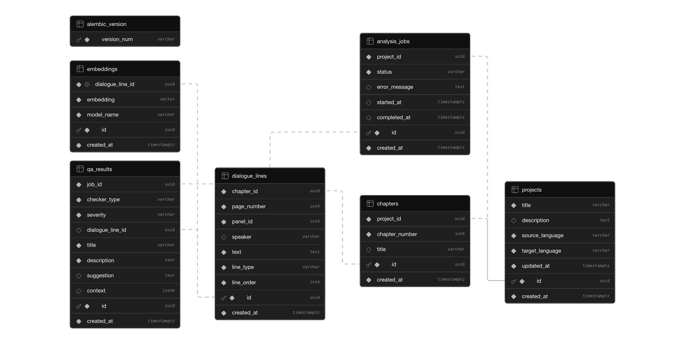

# MangaQA

A web-based manga translation QA tool that automatically evaluates translated manga text for quality issues using LLMs and vector embeddings.

## What It Does

- **Consistency Checker** — Detects terms/names translated differently across chapters
- **Character Voice Checker** — Flags when a character's dialogue deviates from their established speech patterns
- **Tone Checker** — Identifies dialogue that doesn't match the scene's mood
- **Untranslated Text Detector** — Catches Japanese text left in the translation

## Tech Stack

- **Frontend**: React (Vite + TypeScript) + Tailwind CSS
- **Backend**: FastAPI (Python)
- **Database**: PostgreSQL + pgvector (Supabase)
- **AI**: OpenRouter API (LLM) + HuggingFace Inference API (embeddings)
- **Deployment**: Render (backend) + Vercel (frontend)

## Setup

### Backend

```bash
cd backend
python -m venv .venv
source .venv/bin/activate
pip install -r requirements.txt
cp .env.example .env
# Edit .env with your Supabase and OpenRouter credentials
uvicorn app.main:app --reload
```

### Frontend

```bash
cd frontend
npm install
cp .env.example .env
npm run dev
```

### Database

1. Create a [Supabase](https://supabase.com) project
2. Copy the **Session Pooler** connection string to `backend/.env` (use `postgresql+asyncpg://` prefix)
3. Run migrations: `cd backend && .venv/bin/alembic upgrade head`

#### Schema



6 tables: `projects` → `chapters` → `dialogue_lines` → `embeddings`, `projects` → `analysis_jobs` → `qa_results`, with `qa_results` also referencing `dialogue_lines`.

### Create Admin User

```bash
cd backend
# Set ADMIN_USERNAME and ADMIN_PASSWORD in .env first
.venv/bin/python create_user.py
```

## Deployment

### Backend → Render

1. Go to [render.com](https://render.com) → **New → Web Service**
2. Connect the GitHub repo
3. Render reads `render.yaml` and uses `backend/Dockerfile`
4. Set secret env vars in Render dashboard:
   - `DATABASE_URL` — Supabase Session Pooler connection string (`postgresql+asyncpg://...`)
   - `OPENROUTER_API_KEY` — your OpenRouter API key
   - `HF_API_TOKEN` — your [HuggingFace token](https://huggingface.co/settings/tokens)
   - `JWT_SECRET` — generate with `python -c "import secrets; print(secrets.token_hex(32))"`
   - `ADMIN_USERNAME` / `ADMIN_PASSWORD` — login credentials
   - `CORS_ORIGINS` — your Vercel frontend URL (set after Vercel deploy)
5. Deploy → verify at `https://your-app.onrender.com/health`

### Frontend → Vercel

1. Go to [vercel.com](https://vercel.com) → **New Project**
2. Import the same GitHub repo
3. Configure:
   - **Root Directory**: `frontend`
   - **Framework Preset**: Vite
   - **Build Command**: `npm run build`
   - **Output Directory**: `dist`
4. Add env var: `VITE_API_BASE_URL` = `https://your-app.onrender.com`
5. Deploy

### Connect Frontend ↔ Backend

1. Copy the Vercel URL (e.g. `https://mangaqa.vercel.app`)
2. Update Render env var: `CORS_ORIGINS=https://mangaqa.vercel.app`
3. Render redeploys automatically with the new CORS setting
